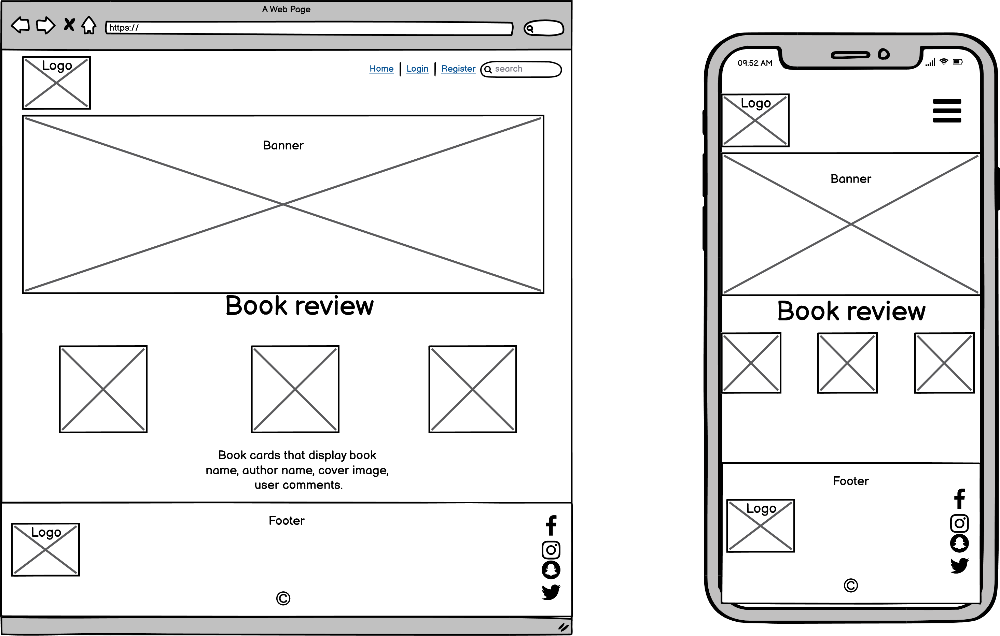
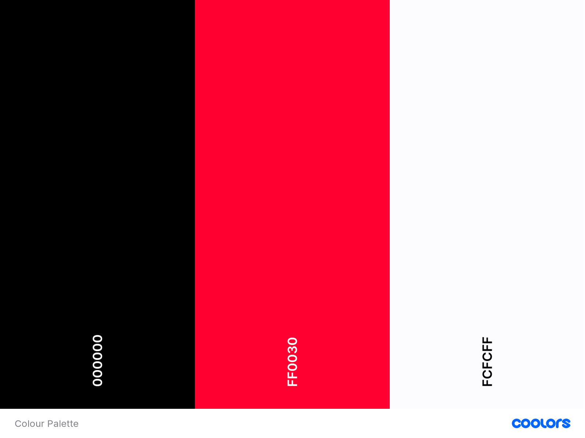
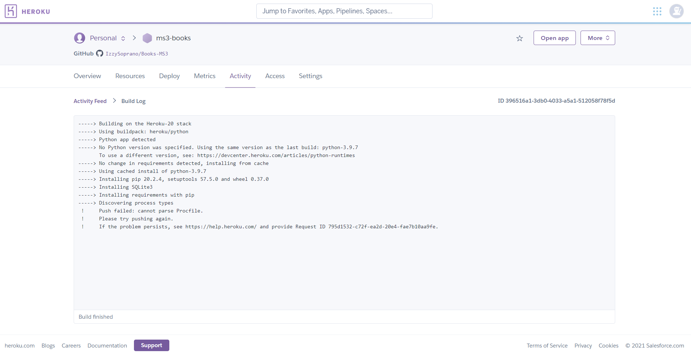
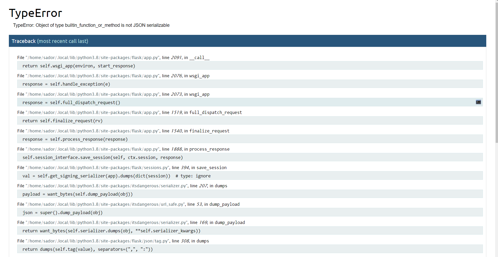
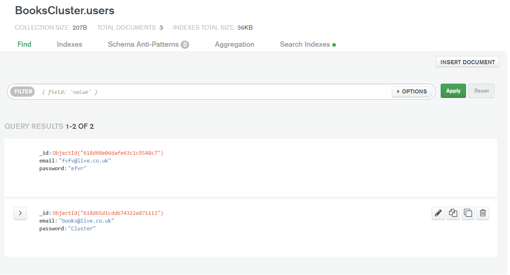
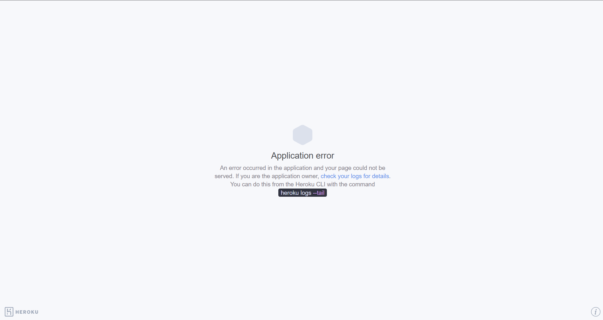

# Table of Contents

1. [Overview](#Overview)
2. [User Experience](<#UX-(UserExperience)>)

- [User Stories](##UserStories)
  - First Time Visitor Goals
  - Returning Visitor Goals
  - Developer Goals

    [Structure](##Structure)
    [Skeleton](##Skeleton)
    [Wireframes](##Wireframes)

3. [Design](#Design)

   - Colour Scheme
   - Fonts
   - Imagery
   - Back-end Design
   - Front-end Design

4. [Features](#Features)

5. [Languages Used](#LanguagesUsed)

6. [Frameworks, Libaries, Tools](#FrameworksLibariesTools)

7. [Testing](#Testing)
   - [Bugs](###Bugs)

8. [Deployment](#Deployment)

9. [Credits](#Credits)

# Overview

**Books** is a site that allows users to keep a log of the books they have read and share their log through reviews with others.
Users who do not want to register to the site will be able to view the books that have been reviewed.
When a user decides to register, they will be able to log books they have read and share their review.

# User Experience

### User Stories

- As a user, I want to be able to register to Books using an email and password, log in and review a book I have read
- As a user, I want to be able to search the site to find other reviews
- As a user, I want an easy to navigate around site
- As a user, I want to be able to access Books's social media accounts
- As a user, I want the structure of the site to be easy on the eye
- As a user, I want to be able securely log out of Books
- As a user, I want to be able to access the site on all devices

### First Time Visitor Goals

- A simple and responsive navigation throughout the site
- To be able to register to Books
- To be able to login and post a review

### Returning Visitor Goals

- To be able to search for reviews
- To be able to post mutiple book reviews

### Developer Goals

- To create a database
- To be able to add, edit and delete book reviews
- To create a responsive, clean and consistent UX

### - Structure

### User Stories:

As a user, I want to be able to register to Books using an email and password, log in and review a book I have read

Criteria

- Site must have a database that is fully functional

Implementation

- Install Mongo DB database

### User Story:

As a user, I want an easy to navigate around site

Criteria

- Add a navigation manu
- Have a Register and Login page
- Display the book reviews in a structured layout on the home page

Implementation

- The UI/UX for the site has to be consistent and clean in order to achieve this

### User Story:

As a user, I want to be able to access Books's social media accounts

Criteria

- Have the site's social media links displayed in the footer

Implementation

- Add social media icons in the footer section of the site

### User Story:

As a user, I want the structure of the site to be easy on the eye

Criteria

- Have a clean UI/UX

Implementation

- Have a consistent UI/UX design throughout the site
- Keeping the colour theme and font simple and consistent throughout the site

### User Story:

As a user, I want to be able securely log out of Books

Criteria

- Have a functional database that allows users to register using their email and password

Implementation

- Implement mongoDB and Flask into the project to link the project together

### User Story:

As a user, I want to be able to access the site on all devices

Criteria

- Have the site responsive across all device platforms

Implementation

- The site will be designed with a mobile first approach to ensure all webpages is working unblemsihed across mobile, tablet and computer screen devices

## - Skeleton

The naigation menu will contiain the following pages:

- Home | home.html
- Register | register.html
- Login | login.html

When the user has successfully registered and logged in the,
the navigation menu will consist of:

- Add Book Review | add_book.html
- Log Out

## - Wireframes

**Home**

**Login**

**Register**

# Design

### Colour Scheme

I've chosen three colours to keep the UI/UX clean and keep the colour scheme of the site consistent by adding this colours to the navbar, footer, login and registration pages.

I'v gone with:

- #000000 | Black
- #FCFCFF | White
- #FF0030 | Light Orange

### Fonts

I will use the 'Courier' font family for the body of the site. This will give it a professional feel and suit the site's aims.

### Imagery

I've adopted the logo to have two colour schemes for the site. As the logo will be displayed in the navbar, and the navbar is black, the logo will be white.

The logo will also be displayed on the main home page. As the background of the home page is white, the logo will be black.

### Back-end design

- The app is created using Python3 and a Flask framework to render the HTML pages.
- The site is deployed via a Heroku app linked to a GitHub repository.
- The dynamic content is served using a MongoDB database.

### Front-end design

When the user has successfully posted their book review, it will be displayed in a card format which will include the book cover and details of the book. The site will require the user to paste a link of the book cover when adding the book review.

# Features

# **Languages Used**

[HTML5](https://developer.mozilla.org/en-US/docs/Web/HTML)
Used as the main markup language for the website content.

[Python3](https://www.python.org/)
Used to create the main application functionality

[CSS3](https://developer.mozilla.org/en-US/docs/Web/CSS)
Used to style the individual webpages.

# **Frameworks, Database, Tools, Deployment**

**Libraries**
[Flask](https://www.fullstackpython.com/flask.html)
Python web framework

[Werkzeug](https://werkzeug.palletsprojects.com/en/1.0.x/)
A comprehensive WSGI web application library installed with Flask

[PyMongo](https://pymongo.readthedocs.io/en/stable/)
PyMongo is a Python tool for working with MongoDB

[Flask-Pymongo](https://flask-pymongo.readthedocs.io/en/latest/)
Flask-PyMongo bridges the gap between Flask and PyMongo

**Database**
[MongoDB Atlas](https://www.mongodb.com/)
Cloud based document-oriented database used to store the backend data.

**Tools**
[Visual Studio Code](https://code.visualstudio.com/)
Visual Studio Code was used for the creation of this site.

[Adobe Logo Maker](https://www.adobe.com/express/create/logo)
Adobe logo maker was used for the creation of the logo

**Deployment**
[Heroku](https://www.heroku.com/)
Heroku is a platform as a service (PaaS) that enables developers to build, run, and operate applications entirely in the cloud.

# Testing

### Bugs/Errors

In doing this project, I've encountered many bugs and errors in creating this site. I have tried to make sure I keep track of each error to showcase them and explain the error as clearly as possible in my README.

#### ***Error #1***
First initial deployment to heroku failed due to the UTF encoding.

#### ***Solution***
After changing to 'Save with encoding', I managed to successfully deploy to Heroku

#### ***Error #2***
Upon first testing to see if my registration page was working and users were able to register, I encontered a Typo error which stated, **rn dumps rv = \_json.dumps(obj, kwargs)**
This error prevented me from adding the user to my Mongo collection

#### ***Solution***
After speaking with tutor support, I successfully mananged to add my users to my Mongo collections everytime a user registered.

#### ***Error***
Upon successfully deployment, I encountered an 'Application error' for my deployment link. I found that upon looking into my heroku log, **_error code=h10_** would come up.

#### ***Solution***
The solution was that there was a bug in my Procfile. After speaking my mentor, he pointed out that I hadn't correctly typed:
`web:gunicorn run:app`

Once I correctly changed it to `web: gunicorn run:app --preload`, the error was solved.

# Deployment

Successful deployment

# Credits

Code Insitute Task Manager Tutorial

Login Page
[How To Create Login Form In HTML and CSS | Make Sign In Form Design](https://www.youtube.com/watch?v=OWNxUVnY3pg)

Registration Page
[Design & Code Responsive Sign Up Form HTML CSS | XO PIXEL](https://www.youtube.com/watch?v=fHqjQBRQxUI&list=PL-wBgXylSsLUjExoShNxnpju44dPRpVtw&index=13)
